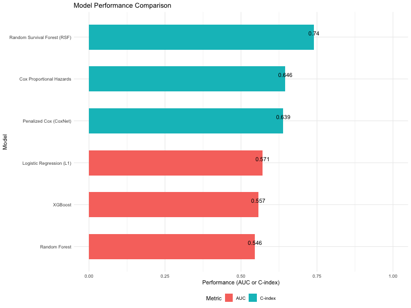

# Prognostic Modeling of Head & Neck Cancer (HNSCC)
### A Comparative Analysis: Traditional Statistics vs. Machine Learning


## 📊 Project Overview
This project challenges traditional survival analysis methods by benchmarking them against modern Machine Learning approaches to predict patient outcomes in **Head and Neck Squamous Cell Carcinoma (HNSCC)**. 

Using clinical data from **The Cancer Genome Atlas (TCGA)**, we identified that **Random Survival Forests (RSF)** significantly outperform traditional Cox Proportional Hazards models, offering a **15% improvement** in prognostic accuracy.

| Metric | Best Model | Score |
| :--- | :--- | :--- |
| **Prediction Accuracy** | **Random Survival Forest (RSF)** | **C-Index: 0.740** |
| **Interpretability** | Penalized Cox (CoxNet) | C-Index: 0.639 |
| **Key Risk Factor** | Tumor Stage IVC | Strongest predictor of mortality |

<p align="center">
  
  <br>
  <em>Figure 1: Benchmark of Survival Models (Blue) vs. Binary Classifiers (Grey). Time-to-Event models demonstrated superior discrimination.</em>
</p>

---

## 🧬 Methodological Evolution
*From Traditional Statistics to AI-Driven Prognostics*

In previous work (Breast Cancer Survival), I relied on standard **Cox Proportional Hazards (CoxPH)** models. While effective for inference, CoxPH struggles with high-dimensional data and non-linear interactions. 

For this project, I evolved the methodology to include:
1.  **Penalized Regression (Lasso/CoxNet):** To handle multicollinearity and perform automatic feature selection.
2.  **Tree-Based Ensemble Methods (RSF):** To capture non-linear relationships that linear models miss.

**Strategic Insight:** We found that treating survival as a binary classification problem (Survived > 2 years) failed due to heavy censorship. Native **Time-to-Event models** are essential for accurate clinical predictions.

---

## 📈 Key Visualizations

### 1. Variable Importance (RSF)
While **Tumor Stage** is the dominant predictor, **Age** and **Primary Site** contribute significant non-linear risk effects captured by the Random Survival Forest.

<p align="center">
  
</p>

### 2. Clinical Utility: Predicted Survival Curves
The models allow for personalized risk stratification. Below are the predicted survival trajectories for different age groups using the CoxNet model.

<p align="center">
  
</p>

---

## 🛠️ Tech Stack & Structure
* **Language:** R
* **Survival Analysis:** `survival`, `survminer`, `glmnet` (Lasso Cox)
* **Machine Learning:** `randomForestSRC` (RSF), `xgboost`, `caret`
* **Visualization:** `ggplot2`, `ggsci` (Nature/Lancet color palettes)

```text
HNSCC-survival-analysis
├── data
│   ├── data_clinical_patient.txt
│   ├── cleaned_clinical_data.rds
│   └── ml_data.RData
├── outputs
│   ├── plots/
│   └── tables/
├── scripts
│   ├── 01_data_loading_cleaning.R
│   ├── 02_exploratory_data_analysis.R
│   ├── 03_statistical_modeling.R
│   ├── 04_machine_learning_rf_modeling.R
│   ├── 05_ml_feature_log_xgb_modeling.R
│   ├── 06_survival_forest_coxnet.R
│   └── 07_results_visualisation_interpretation.R
├── report
│   ├── Final_Report.Rmd
│   └── Final_Report.pdf
├── renv/
├── HNSurvival.Rproj
└── README.md
````

## 🚀 How to Run

This project uses the `{here}` package for easy reproducibility.

1.  **Clone the repo:**
    ```bash
    git clone https://github.com/ruchitha-meenakshi/HNSCC-survival-analysis.git
    ```
2.  **Open Project:** Open `HNSCC-survival-analysis.Rproj` in RStudio.
3.  **Run Analysis:**
    ```r
    # Run the full pipeline
    rmarkdown::render("report/Final_Report.Rmd")
    ```

-----

*Author: Ruchitha Uppuluri*

